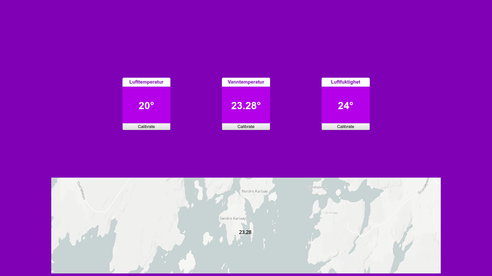

# Readme

## Om

Dette er en eksamensoppgave for PG5500 - Embedded Systems

Oppgaven som er valgt er oppgave b - Iot-device med Particle Photon

### Bakgrunn

Hver sommer tilbringer jeg tid ved mitt sommerhus. Det er hyppige diskusjoner vedrørende temperatur i vannet ved badebrygga. Dagens analoge termometer ligger og flyter i overflaten der solen har stekt og varmet opp overflaten i vannet. For å få korrekt temperatur må en holde den under vann en liten stund. Dette kunne vært løst med et lodd e.l. 

Jeg ønsker med min besvarelse av denne eksamensoppgaven å forbedrede dagens løsning ved å ha et digitalt termostat++ som har flere sensorer: 

- temperatursensor 80-100cm under vannoverflaten
- temperatursensor i luft
- fuktighetssensor i luft
- akselerometer for å måle akselerasjon i z-akse for estimere bølgehøyde.

Merk. eksamensoppgaven bruker LM35 som vanntemperatursensor. 

Med disse dataene kan man hygge seg på brygga med korrekt tilgjengelig vanntemperatur. Sammenligne temperatur med bevegelse i vannet pga. bølger. Sammenligne vanntemperatur med lufttemperatur f.eks. ved nattbad når kanskje lufttemperatur er lavere enn vannet. 

Samt har jeg tilgjengliggjort datene via en klient slik at dataene kan nås fra hvor som helst. Man kan ligge i senga på morran på hytta og se om det frister med et morgenbad, eller man kan drømme seg bort fra skolen i Oslo sentrum.

### API

Data tilgjengelig via [Cloud Functions](https://docs.particle.io/reference/device-os/firmware/photon/#cloud-functions) er:

#### Eventer:

Med Particle Cloud API kan man publisere eventer. Disse kan en f.eks. en klient som en app subscribe på og bruke som den vel.
I dette prosjektet blir det publisert en event hvert minutt. Denne inneholder vann og lufttemperatur samt data fra akselometeret. Dataen ser slik ut:

```json
{
    "gyrometer":{
        "ax":-744,
        "ay":168,
        "az":16588,
        "maxDiffZAxisLast10Measurements":160
        },
    "temperatures":{
        "water":25.44,
        "air":25,
        "humidity":17,
    }
}
```

#### Varibler

Med Particle Cloud API kan man hente ut varibaler man har "bindet" i koden. F.eks en global variabel som oppdateres jevnlig som man ønsker å vite verdien til. Variabler som er eksponert i dette prosjektet er:

1. waterTemp (vanntemperatur fra LM35 temperatursensor + kalibreringsverdi)
2. airTemp (lufttemperatur fra DHT11 sensor + kalibreringsverdi)
3. airHumidity (fuktighet i luft fra DHT11 sensor + kalibreringsverdi)
4. waterTempCalibrationValue (verdi som adderes waterTemp)
5. airTempCalibrationValue (verdi som adderes airTemp)
6. airHumidityCalibrationValue (verdi som adderes airHumidity)
7. currentTimeZone (valgt tidssone)
8. waterTempLightOnLimit (grenseverdi mot vanntemperatur når lys skal være på)

Kan hentes over https med curl slik:

```curl
curl https://api.particle.io/v1/devices/lazysnitch/waterTemp?access_token=<the_access_token>
```

Bytt ut waterTemp med ønsket variabel. Respons for waterTemp er slik:

```json
{
    "cmd":"VarReturn",
    "name":"waterTemp",
    "result":26.240000000000002,
    "coreInfo":{
        "last_app":"",
        "last_heard":"2019-12-15T13:46:28.413Z",
        "connected":true,
        "last_handshake_at":"2019-12-15T11:46:04.168Z",
        "deviceID":"2d001e000f47353136383631",
        "product_id":6
    }
}
```


#### Funksjoner

Med Particle Cloud API kan man også lage "Functions". Med en function kan man trigge en funksjon i applikasjonen som kjører på enheten. Funksjonen kan trigges fra Particle Cloud Desktop eller over https. Funksjoner som er eksponert i min applikasjon er disse:

1. calibrateWaterTempFunction
2. calibrateAirTempFunction
3. calibrateAirHumidityFunction
4. setTimeZone
5. setLightOnLimit

Med disse funksjonene kan brukere kalibrere temperatur, tidssone og vanntemperaturgrensen for når lyset skal lyse.

Kan trigges over curl slik:

```curl
curl https://api.particle.io/v1/devices/lazy-snitch/calibrateWaterTempFunction \
     -d access_token=<the_access_token> \
     -d "args=-2.5"
```

Hvor "calibrateWaterTempFunction" er navnet på funksjonen du kaller og args gir med argumenter til funksjonen. Respons i dette tilfellet vil være(return_value: 1 som betyr suksess):

```json
{
    "id":"2d001e000f47353136383631",
    "last_app":"",
    "connected":true,
    "return_value":1
}   
```

### Video

### Komponenter brukt

- Particle Photon
- DHT11 temp & humidity sensor
- LM35 temperature sensor
- 830 hole breadboard
- SD reader
- Fargeskjerm 80mmX160mm
- 1 x 10k ohm resistor
- 1 x 220 ohm resistor
- 1 x Push-button 12x12mm
- 1 x LED RED


### Fritzing

Jeg har brukt programmet Fritzing for å ha oppkoblingen "lagret". Det er fint å ha når man er nødt til å koble ned og opp. Fzz-fila ligger under /fritzing med navn water-temperature-station.fzz. 

Jeg fant ikke korrekt tft-skjerm og heller ikke korrekt SD-kort del, men har brukt samme utganger i virkeligheten og markerte SD-kort del i fritzing med en label for hva utgangene er. 

Her er en jpg utgave av fritzingen:


### Kode

Jeg valgte å trekke ut kode for hver enkelt komponent jeg har brukt i egen .h og .cpp fil. Grunnen til dette er fordi jeg ønsket en oversiktlig og ryddig "main"(temperatur.ino) fil. 

Setup og loop ser dermed slik ut: 

```c
void setup() {
  particleCommunication.begin();
  setupSerial();

  pinMode(BUTTON_PIN, INPUT);
  delay(2000);

  sdCard.begin();
  tft.begin();
  light.begin();
  gyroscope.begin();
  waterTempSensor.begin();
  airtempAndHumiditySensor.begin();

  tft.clearScreen();
}

void loop() {
  unsigned long currentMillis = millis();

  readChangeTFTScreenPage(currentMillis);
  readFromTempAndHumiditySensors(currentMillis);
  readFromGyrometerAndDrawTheAccelerationDataOnTFT(currentMillis);
  publishEvents(currentMillis);

  tft.drawTime();

  if (shouldShowTempPage) {
    tft.drawTempAndHumidity();
  } else {
    tft.drawWaveIndicationColor();
    tft.drawAcc();
  }
  light.setRedLight();
}

```


Som f.eks. alt som har med Particle kommunikasjon er i particle_communication.cpp slik: 

```c
#include "particle_communication.h"

ParticleCommunication::ParticleCommunication(struct temperatures *ptr_temperaure, struct acceleration_measurements *ptr_acceleration_measurements, struct calibrations *ptr_calibrations, SDCard *ptr_sdcard) {
  m_ptr_temperatures              = ptr_temperaure;
  m_ptr_acceleration_measurements = ptr_acceleration_measurements;
  m_ptr_calibrations              = ptr_calibrations;
  m_ptr_sdcard                    = ptr_sdcard;
}

void ParticleCommunication::begin() {
  Particle.publishVitals(600);

  Particle.variable("waterTemp", m_ptr_temperatures->currentWaterTemp);
  Particle.variable("airTemp", m_ptr_temperatures->currentOnLandTemperature);
  Particle.variable("airHumidity", m_ptr_temperatures->currentOnLandHumidity);
  Particle.variable("currentTimeZone", m_ptr_calibrations->time);
  Particle.variable("waterTempLightOnLimit", m_ptr_calibrations->lightOnLimit);

  Particle.variable("waterTempCalibrationValue", m_ptr_calibrations->waterTempCalibration;
  Particle.variable("airTempCalibrationValue", m_ptr_calibrations->airTempCalibration);
  Particle.variable("airHumidityCalibration", m_ptr_calibrations->landHumidityCalibration;

  Particle.function("calWatTmpF", &ParticleCommunication::calibrateWaterTemp, this);
  Particle.function("calAirTmpF", &ParticleCommunication::calibrateAirTemp, this);
  Particle.function("calAirHumF", &ParticleCommunication::calibrateAirHumidty, this);

  Particle.function("setTimeZone", &ParticleCommunication::setTimeZone, this);

  Particle.function("setLightOnLimit", &ParticleCommunication::setLightOnLimit, this);
}

void ParticleCommunication::publishData() {

  if (Particle.connected()) {
    String data = String::format(
        "{\"gyrometer\": {\"ax\":%d, \"ay\":%d, \"az\":%d, \"maxDiffZAxisLast10Measurements\":%d}, \"temperatures\": {\"water\": %f, \"air\":%f, \"humidity\":%f } }",
        m_ptr_acceleration_measurements->ax,
        m_ptr_acceleration_measurements->ay,
        m_ptr_acceleration_measurements->az,
        m_ptr_acceleration_measurements->diff_in_z_axis_last_ten_measurements,
        m_ptr_temperatures->currentWaterTemp,
        m_ptr_temperatures->currentOnLandTemperature,
        m_ptr_temperatures->currentOnLandHumidity);
    Particle.publish("sensorData", data, PRIVATE);
  }
}

int ParticleCommunication::calibrateWaterTemp(String body) {
  float val = body.toFloat();
  if (isnan(val)) {
    return -1;
  }
  m_ptr_calibrations->waterTempCalibration = val;
  m_ptr_sdcard->openFileToWriteAndWrite();
  return 1;
}

int ParticleCommunication::calibrateAirTemp(String body) {
  float val = body.toFloat();
  if (isnan(val)) {
    return -1;
  }
  m_ptr_calibrations->airTempCalibration = val;
  m_ptr_sdcard->openFileToWriteAndWrite();
  return 1;
}

int ParticleCommunication::calibrateAirHumidty(String body) {
  float val = body.toFloat();
  if (isnan(val)) {
    return -1;
  }
  m_ptr_calibrations->landHumidityCalibration = val;
  m_ptr_sdcard->openFileToWriteAndWrite();
  return 1;
}

int ParticleCommunication::setTimeZone(String body) {
  int val = body.toInt();
  if (isnan(val)) {
    return -1;
  }
  Time.zone(val);
  m_ptr_calibrations->time = val;
  m_ptr_sdcard->openFileToWriteAndWrite();
  return 1;
}

int ParticleCommunication::setLightOnLimit(String body) {
  float val = body.toFloat();
  if (isnan(val)) {
    return -1;
  }
  m_ptr_calibrations->lightOnLimit = val;
  Serial.println("hei");
  Serial.println(val);
  m_ptr_sdcard->openFileToWriteAndWrite();
  return 1;
}
```

Så har jeg logisk delt data inn i structs som kan brukes av flere av .cpp filene etter behov. F.eks. en calibrations struct som brukes for å sette evt. kalibrering på måling av vanntemperatur og adderes med malingen fra sensor før den vises på skjerm eller hentes ut via en varibel i cloud API.  

Algoritme for å estimere bølgehøyde/vannbevegelse er å ta en måling i z-akse. Legge det inn i en kø. Repeterer dette. Hver 10 måling går igjennom køen og finner differansen mellom max og min akselerasjon. Om diffransen er over gitte nivåer viser skjermen grønn, gul rød. Disse nivående bør kalibreres i produksjonsatt miljø. Altså på å sjø. Et problem her er om dingsen snur seg i miljøet. Da vil akselerasjon, i dette tilfellet tyngdekraften ikke beregnes riktig. 


#### Biblioteker

Jeg har brukt 4 bibliotek. Tok utgangspunkt i [Awesome Particle](https://github.com/particle-iot/awesome-particle#particle-libraries), men fant ikke noe som funket til tft-skjermen. Her er bibliotek som er brukt:

- DHT11 temp og fuktighetssensor [Adafruit_DHT_Particle](https://github.com/adafruit/DHT-sensor-library)
- 0.96" tft-skjerm [Adafruit ST7735](https://github.com/menan/adafruit_st7735.git)
- Akselerasjonsmeteret MPU-92.65 [MPU6050](https://github.com/electroniccats/mpu6050)
- SD-kortleser HW-125 [SdFat](https://github.com/greiman/SdFat-Particle.git)


### Videreutvikling

Dette gitt meg flere tanker og jeg ønsker å se på mulighetene for å sette "dingsen" ut til bruk på hytta. Da krever det noe videreutvikling. Slik jeg ser det bruken er:

Inne i en flytebøye til en båt eller brygge legge Photon(eller Argon med 4g) med 1-3 vanntemperatursensorer(forskjellig dybde) og akselerometerer bølgehøyde. Denne Denne må kommunisere enten via mesh-nettverk eller over 4g ettersom det ikke finnes wi-fi på brygga. Så ved badehuset ha en Particle enhet til med en skjerm og luft- og fuktighetssensor. Enheten ved badehuset er the mothership. Slik kan man muliggjøre å ha flere noder. Dette kan være nyttig om man har flere badesteder. F.eks. strand, brygge og berg. 

 Så det jeg har satt opp som to-do er:
- kjøpe en IP68 sertfisert boks eller 3d-printe noe selv. Denne må ihvertfall være vanntett. 
- bruke DS18B20 til å måle temp i vann. Evt. lage en lukket boks rundt sensoren med ferskvann inni. Mulig at salt kan være skadelig over tid. https://www.adafruit.com/product/381 
- Få tak i en Particle device til.
- Lære å sette opp Mesh nettverk med Particle
- Utvide skjerm til å vise vanntemperatur fra flere sensorer(forskjellig dybde og evt. flere devicer)

Jeg trur dette kunne vært en produkt mange ville ha nytte av. Hvis en ser for seg at dette er noe man kan sette ut selv og at alle som har en slik dings kan se andres temperaturer. Hver enhet som målte vanntemperatur/bølger kunne vært knyttet opp til en posisjon slik at målingene kunne vises i et kart. 

Et annet bruksområrde kunne være at man utfra akselerometer kunne skjønt om det var en båt koblet til bøya eller ikke. Da kunne man brukt dingsen til en tyverivarsler. 

### Klient

Tanken her er at man kan ha flere enheter rundt vårt langstrakte land, så kan man trykke på de forskjellige for å se temperatur der de er. 

Jeg har laget en klient med javaScript-rammeverket Vue. For å sette opp denne lokalt må en sette 2 environment variabler i /particle-client/.env:

1. VUE_APP_ACCESS_TOKEN 
2. VUE_APP_DEVICE_ID

Første er access_token fra Particle og andre er device-id til Particle enheten. 

For å kjøre lokalt:

```bash
  >yarn install && yarn serve
```

Det er en SPA som fetcher variablene fra Cloud API direkte ved lasting av siden. Derfra kan man også kalle på funksjonene som er eksponert. Siden ser slik ut:




### Kilder

* Slides fra undervisning. F.eks. "Prosjektslide" for oppsett.
* [Particle dokumentasjon](https://docs.particle.io/reference/device-os/firmware/photon)
* [Vue.js dokumentasjon](https://vuejs.org)